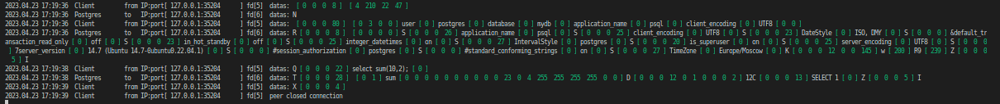

# TCP прокси-сервер для СУБД Postgresql (на C++)
## (ОС `Linux`)

TCP прокси-сервер для СУБД Postgresql с возможностью логирования всех SQL запросов, проходящих через него. 

В прокси-сервере использован Berkley socket (epoll).

Прокси обрабатывает соединения без создания потока на каждое соединение. 

Собрать сервер:
```sh
make
```
Прокси работает на порту `8080`.

Для запуска сервера можно выбрать хост (IPv4) и порт, передав их аргументами при запуске сервера. Порядок аргументов значения не имеет.Если какой-то из параметров не передан, будут использованы значения по умолчанию: `хост 127.0.0.1`, `порт 5432`. \
Выбор порта осуществляется с помощью флага `p`, \
выбор хоста осуществляется с помощью флага `h`.

```sh
./TCPserv h[XXX.XXX.XXX.XXX] p[XXXXX]
```

Примеры, как можно запустить сервер:
```sh
# С портом и хостом по умолчанию: хост 127.0.0.1, порт 5432
./TCPserv

# Выбрать хост
./TCPserv h127.0.0.1

# Выбрать порт
./TCPserv p3456

# Выбрать порт и хост
./TCPserv p3456 h127.0.0.1
```

# Логирование запросов

Логирование запросов осуществляется в директорию `logs`.

Для более гибкой настройки логирования предусмотрен файл `TCPserv.conf`.

В нем можно настроить два параметра:\
`deep logs` глубина логирования от `0` до `4`, \
`output` выведение логов `0` или `1`.

Параметры конфига:
1. `deep logs`

0 - без логов \
1 - логирование сообщений только от клиентов \
2 - логирование сообщений только от базы данных \
3 - логирование сообщений и от клиентов, и от базы данных \
4 - логирование команд из сообщений от клиентов (например из строки сообщения `Q [ 0  0  0  12 ] SELECT; [ 0 ]` будет извлечена в логи только команда `SELECT;`)

2. `output`

0 - вывод логов в файл в директории `logs`. \
1 - вывод логов в стандартный вывод stdout.

```sh
# 0 no logs
# 1 only clients
# 2 only data base (Postgres)
# 3 clients and data base (Postgres)
# 4 only clients commands
# default: 4
deep logs: 4

# 0 to file with path ./logs/logs_date_time
# 1 to stdout (to the standard output)
# default: 0
output: 0
```
В конфигурационном файле допускаются комментарии и пустые строки.
Строки, которые начинаются с решетки `#` являются комментариями.
Посторонние символы и несуществующие параметры делают конфигурационный файл недействительнымю

Параметр конфигурации состоит из именованного поля (например, `deep logs`), двоеточия `:`, обязательного одного пробела ` ` и числового значения параметра (например, `1`).

Структура логов:
```sh
# [дата] [Время]    Отправитель       IP:port[IP:порт]  сокет[fd]    данные: byte1 [длина сообщения в байтах] строка
# [date] [time]     Client       from IP:port[IP:port]  fd[fd]       datas: byte1 [Length of message in bytes] string
# or
# [date] [time]     Postgres       to IP:port[IP:port]  fd[fd]       datas: byte1 [Length of message in bytes] string

```
Пример вывода логов с глубиной логирования `4` в файл :
```
2023.04.23 15:08:15  Client         from IP:port[ 127.0.0.1:35938      ] fd[6]  datas: CREATE FUNCTION sum2(integer, integer) RETURNS integer    AS 'select $1 + $2;'    LANGUAGE SQL    IMMUTABLE    RETURNS NULL ON NULL INPUT; 
2023.04.23 15:08:21  Client         from IP:port[ 127.0.0.1:35938      ] fd[6]  datas: select sum2(10,2);

```
Пример вывода логов с глубиной логирования `3` в `файл`:
```
2023.04.23 15:05:27  Client         from IP:port[ 127.0.0.1:56042      ] fd[6]  datas:  [ 0  0  0  8 ]  [ 4  210  22  47 ] 
2023.04.23 15:05:27  Postgres       to   IP:port[ 127.0.0.1:56042      ] fd[7]  datas: N
2023.04.23 15:05:27  Client         from IP:port[ 127.0.0.1:56042      ] fd[6]  datas:  [ 0  0  0  80 ]  [ 0  3  0  0 ] user [ 0 ] postgres [ 0 ] database [ 0 ] mydb [ 0 ] application_name [ 0 ] psql [ 0 ] client_encoding [ 0 ] UTF8 [ 0  0 ] 
2023.04.23 15:05:27  Postgres       to   IP:port[ 127.0.0.1:56042      ] fd[7]  datas: R [ 0  0  0  8 ]  [ 0  0  0  0 ] S [ 0  0  0  26 ] application_name [ 0 ] psql [ 0 ] S [ 0  0  0  25 ] client_encoding [ 0 ] UTF8 [ 0 ] S [ 0  0  0  23 ] DateStyle [ 0 ] ISO, DMY [ 0 ] S [ 0  0  0 ] &default_transaction_read_only [ 0 ] off [ 0 ] S [ 0  0  0  23 ] in_hot_standby [ 0 ] off [ 0 ] S [ 0  0  0  25 ] integer_datetimes [ 0 ] on [ 0 ] S [ 0  0  0  27 ] IntervalStyle [ 0 ] postgres [ 0 ] S [ 0  0  0  20 ] is_superuser [ 0 ] on [ 0 ] S [ 0  0  0  25 ] server_encoding [ 0 ] UTF8 [ 0 ] S [ 0  0  0 ] 7server_version [ 0 ] 14.7 (Ubuntu 14.7-0ubuntu0.22.04.1) [ 0 ] S [ 0  0  0 ] #session_authorization [ 0 ] postgres [ 0 ] S [ 0  0  0 ] #standard_conforming_strings [ 0 ] on [ 0 ] S [ 0  0  0  27 ] TimeZone [ 0 ] Europe/Moscow [ 0 ] K [ 0  0  0  12  0  0 ] z [ 152  245 ] / [ 175  176 ] Z [ 0  0  0  5 ] I
2023.04.23 15:06:00  Client         from IP:port[ 127.0.0.1:56042      ] fd[6]  datas: Q [ 0  0  0  146 ] CREATE FUNCTION sum(integer, integer) RETURNS integer [ 10 ]     AS 'select $1 + $2;' [ 10 ]     LANGUAGE SQL [ 10 ]     IMMUTABLE [ 10 ]     RETURNS NULL ON NULL INPUT; [ 0 ] 
2023.04.23 15:06:00  Postgres       to   IP:port[ 127.0.0.1:56042      ] fd[7]  datas: C [ 0  0  0  20 ] CREATE FUNCTION [ 0 ] Z [ 0  0  0  5 ] I
2023.04.23 15:06:09  Client         from IP:port[ 127.0.0.1:56042      ] fd[6]  datas: Q [ 0  0  0  22 ] select sum(10,2); [ 0 ] 
2023.04.23 15:06:09  Postgres       to   IP:port[ 127.0.0.1:56042      ] fd[7]  datas: T [ 0  0  0  28 ]  [ 0  1 ] sum [ 0  0  0  0  0  0  0  0  0  0  23  0  4  255  255  255  255  0  0 ] D [ 0  0  0  12  0  1  0  0  0  2 ] 12C [ 0  0  0  13 ] SELECT 1 [ 0 ] Z [ 0  0  0  5 ] I
2023.04.23 15:06:12  Client         from IP:port[ 127.0.0.1:56042      ] fd[6]  datas: X [ 0  0  0  4 ] 
2023.04.23 15:06:12  Client         from IP:port[ 127.0.0.1:56042      ] fd[6]  peer closed connection

```
Пример вывода логов  с глубиной логирования `3` в стандартный вывод `stdout`:




# Тестирование прокси сервера

1. Установить [PostgreSQL](https://postgrespro.ru/docs/postgresql/14/tutorial-start):

Для Ubuntu 22.04 можно:
```sh
sudo apt update
sudo apt install postgresql

# если сервис не запустился после установки, выполнить команду ниже:
sudo systemctl restart postgresql.service
# или :
# sudo service postgresql start
```
2. Создать [базу данных](https://postgrespro.ru/docs/postgresql/14/tutorial-createdb).

После установки PostgreSQL это можно сделать из пользователя `postgres` (добавляется во время установки). Изначально вход не защищен паролем:
```sh
su - postgres
```
Создание базы данных `mydb`:
```sh
createdb mydb
```
Удаление базы данных `mydb`:
```sh
dropdb mydb
```
3. Тестирование.

Тестирование можно провести с помощью клиентского приложения для PostgreSQL. \
Например:
* от [psql](https://postgrespro.ru/docs/postgresql/14/app-psql) отправить запрос к базе данных через прокси сервер ,
* с [pgbench](https://postgrespro.ru/docs/postgresql/14/pgbench) запустить тест производительности PostgreSQL через прокси сервер.

Тестирование через `psql`:
```sh
psql -U postgres -h 127.0.0.1 -p 8080 -d mydb
```
Далее ввести вручную необходимые команды.


Тестирование с помощью `pgbench`:
```sh
pgbench -c 16 -j 16 -T 300 -r -n --host=localhost --port=8080 -b tpcb-like
```
# Полезные ссылки:

[SQL. Клиент-серверный протокол](https://postgrespro.ru/docs/postgresql/14/protocol)

[SQL. Форматы сообщений](https://postgrespro.ru/docs/postgresql/14/protocol-message-formats)
